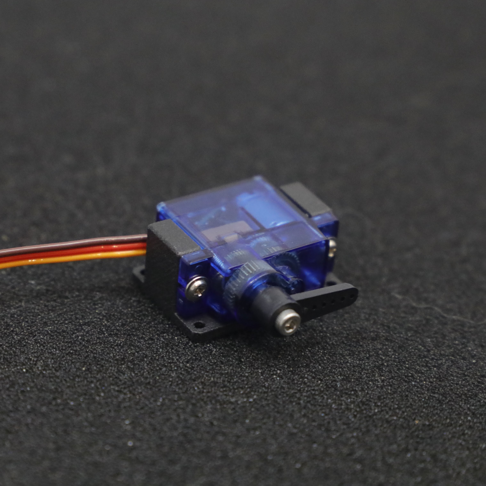
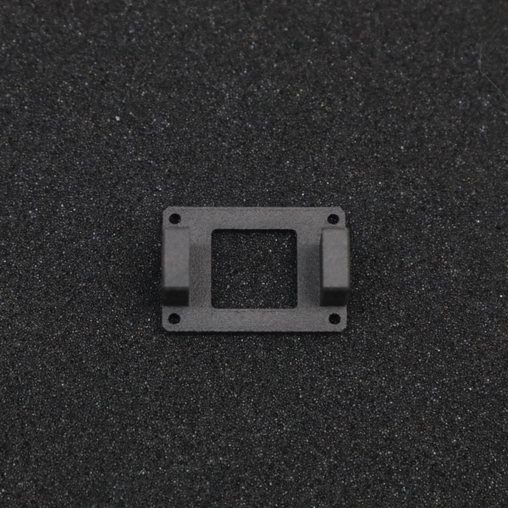
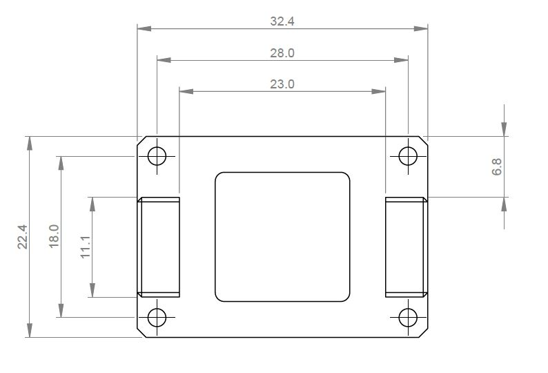

# SG90 SERVO MOUNT v1.0 

  

Each SERVO MOUNT is designed to easily mount the standard SG90 servo without having to make challenging cutouts to suit the servo body. This product was orignially designed for beetle weight combat robotics but is suitable as a sustitute mount for any application using these motors. 

This is a [New Zealand](https://www.google.co.nz/maps/place/Christchurch+New+Zealand) based product by [cb-technology](https://www.cb-technology.co.nz/), Connor Benton.

## FEATURES
- Easiest way to mount SG90 servos: Only requiring 4 holes to be drilled.
- Utilises screws provided with servo to fasten servo and mount together.
- Nylon material allows to flexing under impact loads to minimise chance of failure.

## SPECIFICATIONS
- **Dimensions:** 32.5 x 22.5 x 14.5 mm
- **Weight:** 3g each
- **Material:** Nylon 12
- **Included in Package:** 1x SERVO MOUNT, 4 M2 Cap Screws + Nuts.

## FACEPLATE INSTALL PATTERN

